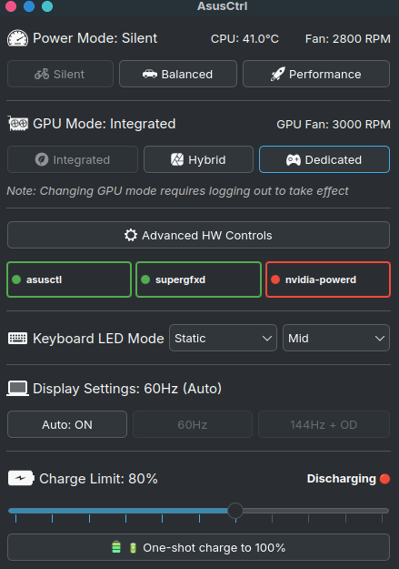
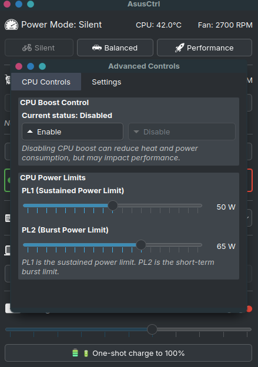
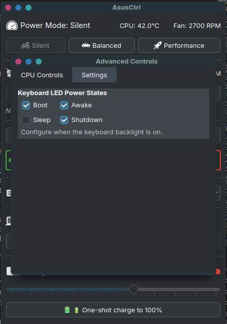

# AsusCtrl - KDE Plasma Widget

A comprehensive KDE Plasma widget for controlling ASUS TUF series laptops, providing easy access to power management, GPU switching, thermal controls, keyboard lighting, and system monitoring.


## 📸 Screenshots

### Main Widget Interface


*Main widget showing power profiles, GPU mode, and system monitoring*

### Compact Panel View


*Compact widget icon in the system panel - changes based on current GPU mode*

### Advanced Hardware Controls


*Advanced controls window with CPU power limits, keyboard lighting, and detailed settings*


### Keyboard Lighting


*Keyboard lighting control with modes and bios settings*


## 🚀 Quick Setup

** Download and run the install script:

```bash
git clone https://github.com/Jalal82/AsusCtrl.git
cd AsusCtrl
chmod +x install.sh
./install.sh
```

Then add the widget to your panel: Right-click panel → Add Widgets → Search "AsusCtrl"

---

## ✨ Features

### Core Controls
- **Power Profiles**: Silent, Balanced, Performance modes
- **GPU Mode Switching**: Integrated, Hybrid, Dedicated (with automatic logout/reboot handling)
- **Battery Charge Limiting**: Customizable charge thresholds (50-100%)
- **CPU Turbo Boost**: Enable/disable CPU boost for thermal management
- **CPU Power Limits**: Advanced PL1/PL2 power limit controls

### Advanced Features
- **Keyboard RGB Lighting Control**: Full RGB control via D-Bus interface
  - Multiple lighting modes (Static, Breathing, Fast)
  - Per-state power control (Boot, Awake, Sleep, Shutdown)
  - Brightness adjustment (0-3 levels)
- **Display Settings**: Panel overdrive toggle and refresh rate control
- **Auto Display Mode**: Automatic display optimization based on power status
- **System Monitoring**: Real-time CPU/GPU temperatures and fan speeds
- **Service Status**: Monitor asusctl, supergfxd, and nvidia-powerd services

### User Interface Features
- **Dynamic Panel Icon**: Changes based on current GPU mode
- **Optimistic UI Updates**: Instant visual feedback while commands execute
- **Intelligent Command Queuing**: Handle multiple rapid clicks gracefully
- **Auto-revert on Failure**: UI automatically reverts if commands fail
- **Real-time Status Updates**: Live monitoring of system state

## 🚀 Installation

### Option 1: Automatic Installation (Recommended)

The easiest way to install the widget is using the automated install script:

1. **Download and Extract:**
   ```bash
   # Download the latest release
   wget https://github.com/Jalal82/AsusCtrl/archive/main.zip
   unzip main.zip
   cd AsusCtrl-main
   
   # Or clone the repository
   git clone https://github.com/Jalal82/AsusCtrl.git
   cd AsusCtrl
   ```

2. **Run the Install Script:**
   ```bash
   chmod +x install.sh
   ./install.sh
   ```

The script will automatically:
- ✅ Detect your Linux distribution and package manager
- ✅ Install required system dependencies (asusctl, supergfxctl, python packages)
- ✅ Enable and start necessary system services
- ✅ Copy widget files to the correct location
- ✅ Set up proper file permissions
- ✅ Configure polkit rules and sudo access
- ✅ Create udev rules for battery charge control
- ✅ Install optional dependencies when available
- ✅ Restart Plasma shell to load the widget

**Supported Distributions:**
- Arch Linux (pacman + AUR) (tested)
- Garuda Linux (Arch-based with gaming optimizations) (tested)
- CachyOS (Arch-based with Bore kernel support) (tested)


### Option 2: Manual Installation

If you prefer manual installation or the automatic script doesn't work for your system:

#### Prerequisites

1. **Required System Services:**
   ```bash
   # Install ASUS control utilities
   sudo pacman -S asusctl supergfxctl  # Arch Linux
   # or
   sudo apt install asusctl supergfxctl  # Ubuntu/Debian
   
   # Enable and start services
   sudo systemctl enable --now asusd
   sudo systemctl enable --now supergfxd
   ```

2. **Python Dependencies:**
   ```bash
   sudo pacman -S python-dbus python-psutil  # Arch Linux
   # or
   sudo apt install python3-dbus python3-psutil  # Ubuntu/Debian
   ```

3. **Optional Dependencies:**
   ```bash
   # For AMD CPU power limits
   sudo pacman -S ryzenadj  # AUR package
   
   # For NVIDIA GPU monitoring
   sudo pacman -S nvidia-utils
   ```

#### Widget Installation

1. **Download the Widget:**
   ```bash
   git clone https://github.com/Jalal82/AsusCtrl.git
   cd AsusCtrl
   ```

2. **Install to User Directory:**
   ```bash
   # Create the plasmoid directory
   mkdir -p ~/.local/share/plasma/plasmoids/
   
   # Copy the widget files
   cp -r org.kde.plasma.asustufcontrol ~/.local/share/plasma/plasmoids/
   ```

3. **Set Execute Permissions:**
   ```bash
   chmod +x ~/.local/share/plasma/plasmoids/org.kde.plasma.asustufcontrol/contents/scripts/helper.py
   chmod +x ~/.local/share/plasma/plasmoids/org.kde.plasma.asustufcontrol/contents/scripts/asus_keyboard_lighting_control.py
   ```

#### System Configuration

1. **Configure Polkit Rules:**
   ```bash
   sudo nano /etc/polkit-1/rules.d/90-asustufcontrol.rules
   ```
   
   Add the following content:
   ```javascript
   polkit.addRule(function(action, subject) {
       if ((action.id == "org.freedesktop.policykit.exec" &&
            action.lookup("program") == "/usr/bin/python3" &&
            action.lookup("command_line").indexOf("helper.py") !== -1) &&
           subject.isInGroup("wheel")) {
               return polkit.Result.YES;
       }
   });
   ```

2. **Configure Sudo Access:**
   ```bash
   sudo nano /etc/sudoers.d/asustufcontrol
   ```
   
   Add (replace `yourusername` with your actual username):
   ```
   yourusername ALL=(ALL) NOPASSWD: /usr/bin/python3 /home/yourusername/.local/share/plasma/plasmoids/org.kde.plasma.asustufcontrol/contents/scripts/helper.py *
   ```

3. **Configure Battery Charge Limit Permissions:**
   ```bash
   sudo nano /etc/udev/rules.d/99-asus-charge-limit.rules
   ```
   
   Add:
   ```
   ACTION=="add", SUBSYSTEM=="power_supply", ATTR{name}=="BAT1", RUN+="/bin/chmod a+w /sys/class/power_supply/BAT1/charge_control_end_threshold"
   ```
   
   Apply the rules:
   ```bash
   sudo udevadm control --reload-rules
   sudo udevadm trigger
   ```

4. **Enable CPU Power Limit Control (Intel):**
   ```bash
   # Enable turbo boost control
   sudo x86_energy_perf_policy --turbo-enable 1
   
   # Verify no_turbo status
   cat /sys/devices/system/cpu/intel_pstate/no_turbo
   ```

### Adding to Panel (Both Installation Methods)

1. Right-click on your KDE Plasma panel
2. Select "Add Widgets..."
3. Search for "AsusCtrl"
4. Drag the widget to your panel or desktop

**Note:** If the widget doesn't appear immediately after installation:
- Log out and back in (to ensure all permissions are applied)
- Or restart Plasma shell: `plasmashell --replace &`

## 🗑️ Uninstallation

### Option 1: Automatic Uninstallation (Recommended)

Use the provided uninstall script:

```bash
# Navigate to the widget directory
cd /path/to/asus-tuf-control

# Run the uninstall script
./uninstall.sh
```

The script will:
- ✅ Remove all widget files
- ✅ Optionally remove system configuration (polkit, sudo, udev rules)
- ✅ Restart Plasma shell
- ✅ Keep system services running (they may be used by other apps)

### Option 2: Manual Uninstallation

To manually remove the widget and its configuration:

#### Remove Widget Files
```bash
# Remove the widget directory
rm -rf ~/.local/share/plasma/plasmoids/org.kde.plasma.asustufcontrol

# Restart Plasma shell
plasmashell --replace &
```

#### Remove System Configuration (Optional)
If you want to remove all system-level configuration:

```bash
# Remove polkit rules
sudo rm -f /etc/polkit-1/rules.d/90-asustufcontrol.rules

# Remove sudoers configuration  
sudo rm -f /etc/sudoers.d/asustufcontrol

# Remove udev rules
sudo rm -f /etc/udev/rules.d/99-asus-charge-limit.rules
sudo udevadm control --reload-rules

# Note: System services (asusd, supergfxd) are left running as they may be used by other applications
```

## 🖼️ Widget Preview

### Main Interface States

| Power Mode | GPU Mode | Panel Icon | Description |
|------------|----------|------------|-------------|
| Silent | Integrated |  | Power-saving mode with integrated graphics |
| Balanced | Hybrid |  | Balanced performance with hybrid graphics |
| Performance | Dedicated |  | Maximum performance with dedicated GPU |


## 🎮 Usage

### Main Interface
- **Power Profile Buttons**: Quick switching between Silent/Balanced/Performance
- **GPU Mode Toggle**: Switch between Integrated/Hybrid/Dedicated graphics
- **Battery Slider**: Adjust charge limit from 50% to 100%
- **System Monitoring**: View real-time CPU temperature and fan speeds
- **Advanced Controls**: Access detailed power and lighting controls

### Widget Behavior
- **Panel Icon**: Dynamically changes to show current GPU mode
  -    Integrated GPU (power saving)
  -    Hybrid mode (balanced)
  -    Dedicated GPU (performance)
  - 
- **Visual Feedback**: Buttons highlight when active, disable when unavailable
- **Status Updates**: Real-time updates every 3 seconds, immediate on changes

### Advanced Controls Window
Access via the "Advanced HW Controls" button for:

#### CPU Controls
- **Turbo Boost Toggle**: Enable/disable CPU boost
- **Power Limits**: Adjust PL1 (sustained) and PL2 (burst) power limits
- **Real-time Monitoring**: View current CPU temperature and fan speed

#### Keyboard Lighting
- **Brightness Control**: 4-level brightness adjustment (0-3)
- **Lighting Modes**: 
  - Static (mode 0)
  - Breathing (mode 1) 
  - Fast pulse (mode 10)
- **Power States**: Configure lighting for Boot/Awake/Sleep/Shutdown

#### Display Settings
- **Panel Overdrive**: Toggle high refresh rate display overdrive
- **Refresh Rate**: Monitor and control current display refresh rate
- **Auto Display Mode**: Automatic optimization based on power status

### Command Line Interface

The widget includes standalone Python scripts for automation:

```bash
# Keyboard lighting control
python3 ~/.local/share/plasma/plasmoids/org.kde.plasma.asustufcontrol/contents/scripts/asus_keyboard_lighting_control.py status
python3 ~/.local/share/plasma/plasmoids/org.kde.plasma.asustufcontrol/contents/scripts/asus_keyboard_lighting_control.py brightness 2
python3 ~/.local/share/plasma/plasmoids/org.kde.plasma.asustufcontrol/contents/scripts/asus_keyboard_lighting_control.py mode 1

# System control
python3 ~/.local/share/plasma/plasmoids/org.kde.plasma.asustufcontrol/contents/scripts/helper.py profile performance
python3 ~/.local/share/plasma/plasmoids/org.kde.plasma.asustufcontrol/contents/scripts/helper.py gpu hybrid
python3 ~/.local/share/plasma/plasmoids/org.kde.plasma.asustufcontrol/contents/scripts/helper.py charge 80
```

## 📋 Supported Hardware

### Tested Models
- ASUS TUF Gaming F15 series
- ASUS TUF Gaming A15 series
- ASUS TUF Gaming F17 series
- ASUS ROG Strix series (partial support)

### Hardware Requirements

| Component | Requirement | Notes |
|-----------|------------|-------|
| **CPU** | Intel/AMD with power controls | RAPL support for Intel, ryzenadj for AMD |
| **GPU** | NVIDIA/AMD with MUX switch | Hybrid graphics support required |
| **Display** | Variable refresh rate panel | Optional for display controls |
| **Keyboard** | ASUS Aura RGB backlight | Optional for lighting controls |
| **Battery** | ASUS charge limit support | Required for battery management |

### Kernel Compatibility
- **CachyOS kernel** (bore) - Tested and verified
- **Custom kernels** with ASUS laptop asusd / wmi support support

### CPU Support
- **Intel**: Core i5/i7/i9 with RAPL power controls
- **AMD**: Ryzen 5/7/9 with ryzenadj support (to be tested)

### GPU Support
- **NVIDIA**: GTX/RTX series with MUX switch support
- **AMD**: RX series with hybrid graphics (to be tested)
- **Intel**: Integrated graphics 

## 🤝 Contributing

1. Fork the repository
2. Create a feature branch: `git checkout -b feature-name`
3. Commit changes: `git commit -am 'Add feature'`
4. Push to branch: `git push origin feature-name`
5. Submit a Pull Request

### Development Setup
```bash
# Clone for development
git clone https://github.com/Jalal82/AsusCtrl.git
cd AsusCtrl

# Install in development mode (symlink)
ln -s $(pwd)/org.kde.plasma.asustufcontrol ~/.local/share/plasma/plasmoids/

# Restart plasma to reload changes
kquitapp5 plasmashell && kstart5 plasmashell
```

## 📝 License

This project is licensed under the GPL-2.0+ License - see the [LICENSE](LICENSE) file for details.

## 🙏 Acknowledgments

- [asusctl](https://gitlab.com/asus-linux/asusctl) - Core ASUS laptop control utilities
- [supergfxctl](https://gitlab.com/asus-linux/supergfxctl) - GPU switching functionality
- ASUS Linux community for hardware documentation and support
- KDE Plasma development team for the widget framework

## ⭐ Support

If you find this widget useful, please:
- ⭐ Star this repository
- 🐛 Report bugs via GitHub Issues
- 💡 Suggest features via GitHub Discussions
- 📖 Improve documentation via Pull Requests

## 🔗 Related Projects

- [asusctl](https://gitlab.com/asus-linux/asusctl) - Command-line ASUS laptop control
- [G-Helper](https://github.com/seerge/g-helper) - Windows ASUS control utility (inspiration)
- [ROG Control Center](https://github.com/luke-nukem/asus-rog-control-center) - Alternative Linux ASUS control

---

**Made with ❤️ for the ASUS Linux community**
